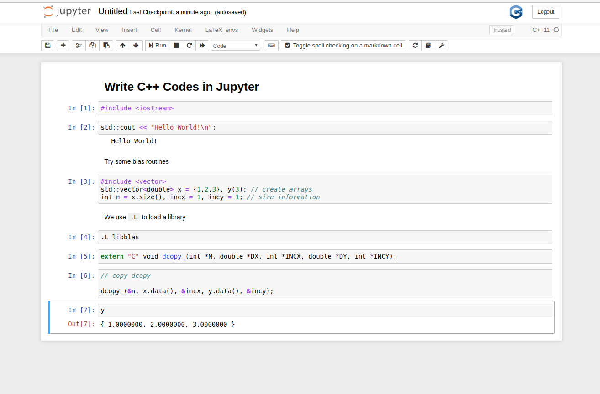

# Docker Image for AMS 562
This Docker image provides the Ubuntu 22.04 LTS environment with X Windows for the class "AMS 562: Introduction to Scientific Programming in C++" at Stony Brook University. The image runs the lightweight LXDE Windows Manager, and has `GCC-11`, `VScode`, `BLAS/LAPACK`, `valgrind`, `ddd`, `Eigen`, `boost`, `OpenMPI`, `OpenMP`, `Jupyter`, and `xeus-cling` preinstalled. The X Windows will display in your web browser in full-screen mode.
You can use this Docker image on Intel or ARM-based 64-bit Linux, Mac or Windows. It allows you to use the same programming environment regardless which OS you are running on your laptop or desktop.




[](https://github.com/compdatasci/ams562-desktop/actions/workflows/docker-image.yml)

## Preparation
Before you start, you need to first install Python and Docker on your computer by following the steps below.

### Installing Python
If you use Linux or Mac, Python 3.x is most likely already installed on your computer, so you can skip this step.

If you use Windows, you need to install Python if you have not yet done so. The easiest way is to install `Miniconda`, which you can download at https://repo.continuum.io/miniconda/Miniconda3-latest-Windows-x86_64.exe. During installation, make sure you check the option to make Miniconda the system's default Python.

### Installing Docker
Download Docker Desktop for free at https://docs.docker.com/get-docker/ and then run the installer. Note that you need administrator's privilege to install Docker. After installation, make sure you launch Docker before proceeding to the next step.

**Notes for Windows Users**
1. Docker only supports 64-bit Windows 10 Pro or higher. It is highly recommended that you install Docker Desktop with the WSL 2 backend instead of the Hyper-V backend. The latter only supports Enterprise or Education versions, has lower performance, and requires additional configuration steps.
2. For security reasons, it is recommended that you do not use Docker in the Administrator account, even if you are the sole user on the computer.

**Notes for Mac Users**
1. Docker Desktop supports only MacOS 10.15 or newer. The Docker image for AMS 562 supports both Intel chips and Apple M1 chips natively. 
Please make sure that you install Docker Desktop for Mac that is native to your computer's CPU.
2. By default, Docker uses half the number of processors and 2GB of memory on Mac. If you want to run large jobs, you can increase the amount of memory or the number of cores dedicated to Docker. Just click on the Docker icon in the system tray, select `Preferences` and then select the `Advanced` tab to adjust the settings.

**Notes for Linux Users**
* Most Linux distributions have a `docker` package. You can use the package installer for your system to install `docker`. Note that on some system (e.g., OpenSUSE), you may need to run the following commands to start up `docker` after installing `docker`:
```
sudo systemctl enable docker
sudo systemctl start docker
```
* After you install Docker, make sure you add yourself to the `docker` group. On Ubuntu, this is done by running the command:
```
sudo adduser $USER docker
```
On other systems, try the following command.
```
sudo usermod -G docker -a $USER
```
After adding yourself to the `docker` group, you need to log out and log back in before you can use Docker.
## Running the Docker Image
To run the Docker image, first download the scripts [`ams562_desktop.py`](https://raw.githubusercontent.com/compdatasci/ams562-desktop/main/ams562_desktop.py)
and [`ams562_jupyter.py`](https://raw.githubusercontent.com/compdatasci/ams562-desktop/main/ams562_jupyter.py)
and save them to the working directory where you will store your codes and data. You can download the script using command line: On Windows, start `Windows PowerShell`, use the `cd` command to change to the working directory where you will store your codes and data, and then run the following command:
```
curl https://raw.githubusercontent.com/compdatasci/ams562-desktop/main/ams562_desktop.py -outfile ams562_desktop.py
curl https://raw.githubusercontent.com/compdatasci/ams562-desktop/main/ams562_jupyter.py -outfile ams562_jupyter.py
```
On Linux or Mac, start a terminal, use the `cd` command to change to the working directory, and then run the following command:
```
curl -s -O https://raw.githubusercontent.com/compdatasci/ams562-desktop/main/ams562_desktop.py
curl -s -O https://raw.githubusercontent.com/compdatasci/ams562-desktop/main/ams562_jupyter.py
```

After downloading the script, you can start a desktop environment using the command
```
python3 ams562_desktop.py -p
```
or start a Jupyter Notebook with C++ support using the command
```
python3 ams562_jupyter.py -p
```

The command will download and run the Docker image and then launch your default web browser to show the desktop environment. The `-p` option is optional, and it instructs the Python script to pull and update the image to the latest version.

For additional command-line options, use the command
```
python3 ams562_desktop.py -h
```
or 
```
python3 ams562_jupyter.py -h
```

### Running the Docker Image Offline
After you have download the Docker image using the `curl` and `python` commands above, you can run the image offline without internet connection using the following command:
```
python3 ams562_desktop.py
```
or 
```
python3 ams562_jupyter.py
```
in the directory where you ran the `curl` command above.

### Stopping the Docker Image
To stop the Docker image, press Ctrl-C twice in the terminal (or Windows PowerShell on Windows) on your host computer where you started the Docker image, and close the tab for the desktop in your web browser or VNC viewer.

## Entering Full-Screen Mode for Desktop Environment
For the best experience, use [VNC Viewer](http://realvnc.com/download/viewer) to connect to Docker image with the port and password displayed in the terminal output, which supports the full-screen mode. If you don't have the VNC viewer, you can
also use the full-screen mode in a web browser.

When using a web browser, we recommend *Google Chrome*, *Chromium browser*, or *Microsoft Edge*, which has similar user interfaces. On Windows or Linux, you can enter full-screen mode by selecting the menu `View --> "Full Screen"` Alternatively, open the Chrome menu (the three vertical dots at the top right) and select the square to the far right of the Zoom buttons (the "+" and "-" buttons). To exit the full-screen mode, press the `F11` key. On Mac, it behaves similarly except that the menu item is named `Enter Full Screen` instead of `Full Screen`, and the keyboard shortcut is `Ctrl-Cmd-f` instead of `F11`. You can also click on the green circle at the top-left corner of *Google Chrome* to enter and exit the full-screen mode. Note that in the full-screen mode, you need to disable `Always Show Toolbar in Full Screen` under the `View` menu of `Google Chrome`, and you can reveal the menu and the toolbar by sliding your mouse to the top of the display.

Alternatively, you can also use the "native" browsers on different platforms.
- On Windows, you can use the native browser *Microsoft Edge*. Toggle on and off the full-screen mode by pressing Win+Shift+Enter (hold down the Windows and Shift keys and press Enter).
- On Mac, you can use the native browser *Safari*, for which you can toggle the full-screen mode by clicking on the green circle at the top-left corner of *Safari* or selecting the `View --> "Enter Full Screen"` menu. To exit the full-screen mode, press `Ctrl-Cmd-f`, or slide your mouse to the top of the display to enable the menus.
- On Linux, the default browser *Firefox* does not hide its address bar in its native full-screen mode. You are recommended to use *Google Chrome* or *Chromium browser* instead. However, you can use *Firefox* for a full-screen viewing mode by clicking on the `Fullscreen` button in the left sidebar of Docker desktop environment. However, this is not recommended for day-to-day use, because *Firefox* would exit this full-screen mode whenever you press `Esc`, which may happen quite often.

If your Docker desktop environment started automatically in a non-recommended browser, you can copy and paste the URL into a recommended browser.
## Tips and Tricks
1. When using the Docker desktop, the files under `$HOME/.config`, `$HOME/.ssh`, , `$HOME/project`,  `$HOME/shared` and any other
directory that you might have mounted explicitly are persistent. Any change to files in other directories will be lost when the Docker container stops. Use `$HOME/.config` to store the configuration files of the desktop environment. `$HOME/shared` maps to the working directory on the host, and you are recommended to use it or a mounted project directory to store codes and data.
2. The `$HOME/.ssh` directory in the Docker container maps to the `.ssh` directory on your host computer. This is particularly convenient for you to use your ssh-keys for authentications with git repositories (such as github or bitbucket). To use your ssh keys, run the `ssh-add` in a terminal to add your keys to the ssh-agent.
3. You can copy and paste between the host and the Docker desktop through the `Clipboard` box in the left toolbar, which is synced automatically with the clipboard of the Docker desktop. To copy from the Docker desktop to the host, first, select the text in the Docker desktop, and then go to the `Clipboard` box to copy. To copy from host to the Docker desktop, first, paste the text into the `Clipboard` box, and then paste the text in the Docker desktop.
4. To stop the Docker container, do not just close the browser window, because the Docker container would still be running in the background. Instead, you can stop the container using one of the following approaches:
 - Use the `logout` button in the lower-left corner of the Docker desktop,
 - Press Ctrl-C twice in the terminal where you started the python script, or
 - Run the command `docker stop <Container ID>` in a terminal on the host, and you can find the `Container ID` using the `docker ps -a` command.
